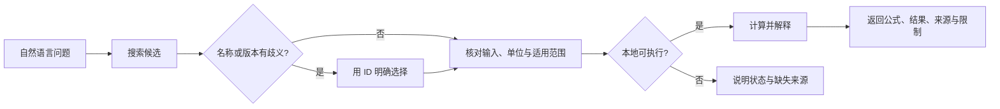

<p align="center">
  
</p>

<h1 align="center">Clinical Calculator</h1>

<p align="center">
  <a href="https://github.com/JuneYaooo/clinical-calculator/actions/workflows/test.yml"></a>
  
  
  
  <a href="./LICENSE"></a>
</p>

<p align="center">
  用自然语言查找、选择、运行和解释临床计算器；也可以把可靠来源中的公式或规则保存为可验证的自定义计算器。
</p>

<p align="center">
  <a href="#30-秒开始">快速开始</a> ·
  <a href="./SKILL.md">Skill 工作流</a> ·
  <a href="./references/calculator-cli.md">CLI 参考</a> ·
  <a href="./CONTRIBUTING.md">参与贡献</a>
</p>

> [!IMPORTANT]
> 这是一个面向支持 `SKILL.md` 的 AI Agent 的能力库，不是独立诊疗产品。计算结果仅用于决策支持、教学与核对，不能替代专业诊断、处方或紧急处置。

## 30 秒开始

### 交给 Agent 使用

```bash
git clone https://github.com/JuneYaooo/clinical-calculator.git
```

把仓库目录交给 Codex、Claude Code 或其他支持 Agent Skills 的工具，然后直接描述需求：

```text
帮我找一下评估房颤卒中风险的计算器，并告诉我需要哪些输入。
```

```text
患者体重 70 kg、身高 175 cm，计算 BMI，并说明公式、结果、来源和限制。
```

### 直接使用 CLI

项目运行时只依赖 Python 标准库：

```bash
python3 scripts/clinical_calculator.py search "房颤 卒中"
python3 scripts/clinical_calculator.py info CALC-0049
python3 scripts/clinical_calculator.py run CALC-0039 \
  --input weight_kg=70 \
  --input height_cm=175
```

CLI 输出结构化 JSON，便于 Agent、脚本和评测管线稳定消费。

## 它解决什么问题

| 临床计算中的常见风险 | 本项目的处理方式 |
| --- | --- |
| 同名评分存在人群或版本差异 | 搜索后按唯一 ID 解析；歧义名称不会静默代选 |
| 输入、单位或边界不明确 | 每个可执行条目暴露机器可读的输入契约 |
| 目录中“有名字”被误当成“能计算” | 严格区分可执行、待回源、指南知识和受控内容 |
| 缺失系数被模型凭记忆补全 | 不从名称、摘要或记忆反推公式、表格和阈值 |
| 有代码被误解为已获临床批准 | 自动化检查与临床发布状态完全分离 |
| 第三方问卷或分期内容存在权利限制 | 受控内容只保留路由信息，不擅自复刻 |

## 工作方式



默认搜索只返回真正可执行的条目。审计完整目录时，可显式使用 `--all` 或指定 `--layer`。

## 当前覆盖

| 目录层 | 数量 | 含义 |
| --- | ---: | --- |
| `executable` | **643** | 本地已有明确输入契约与计算逻辑 |
| `source_candidate` | **110** | 需要补充原始公式、系数、表格或版本 |
| `guidance_knowledge` | **206** | 属于指南路径、用药规则或预防知识，不伪装成单一公式 |
| `controlled_content` | **95** | 受问卷版权、订阅或版本约束 |

目录共包含 **1,054** 个有效逻辑条目、**981** 个唯一中文名称；**84** 个旧重复 ID 已合并为兼容别名。643 个可执行条目覆盖 570 个唯一中文名称。

`complete` 表示“本地可执行”，不表示“已通过临床发布”。当前临床发布允许列表为空。

## 常用命令

| 目标 | 命令 |
| --- | --- |
| 查看覆盖摘要 | `python3 scripts/clinical_calculator.py summary` |
| 搜索可执行计算器 | `python3 scripts/clinical_calculator.py search "关键词"` |
| 搜索完整目录 | `python3 scripts/clinical_calculator.py search "关键词" --all` |
| 查看输入、单位与来源 | `python3 scripts/clinical_calculator.py info CALC-0039` |
| 运行指定计算器 | `python3 scripts/clinical_calculator.py run CALC-0039 --input weight_kg=70 --input height_cm=175` |
| 校验注册表 | `python3 scripts/clinical_calculator.py validate` |
| 查看回源队列 | `python3 scripts/clinical_calculator.py backlog --limit 20` |
| 生成自定义模板 | `python3 scripts/clinical_calculator.py scaffold --help` |

完整参数与结果状态见 [CLI 参考](./references/calculator-cli.md)。

## 自定义计算器

支持把有可靠来源的标量公式、多输出公式、查表和决策树保存为 JSON manifest。流程始终是：

1. 从来源提取明确的输入、单位、边界、规则、版本和已知答案。
2. 生成草稿并运行 schema 与测试案例校验。
3. 向用户展示拟安装内容；只有确认后才写入可执行目录。

```bash
python3 scripts/clinical_calculator.py scaffold \
  --output /tmp/my-calculator.json \
  --id CUSTOM-MY-CALC \
  --name-cn "我的计算器" \
  --name-en "My Calculator"

python3 scripts/clinical_calculator.py validate-custom /tmp/my-calculator.json
```

详见 [自定义计算器规范](./references/custom-calculators.md)。

## 项目结构

```text
clinical-calculator/
├── SKILL.md                         # Agent 工作流与安全约束
├── clinical_calculators/            # 注册表、模型、扩展与计算实现
│   └── calculators/common/          # 按临床主题拆分的计算器模块
├── scripts/clinical_calculator.py   # JSON CLI
├── tests/                           # 公式、边界、状态与安全回归测试
├── references/                      # CLI 与自定义 manifest 规范
├── reports/                         # 实现状态、来源审计与待办分类
└── clinical_calculator_inventory_full.csv
```

## 质量与验证

仓库包含 937 项自动化测试，覆盖注册表完整性、输入边界、已知答案、自定义 manifest 沙箱、目录分层和临床发布状态隔离。每次 push 和 pull request 都会在 Python 3.10、3.12、3.13 上运行校验。

```bash
python3 scripts/clinical_calculator.py validate
python3 -m pytest -q
```

新增或修改医学计算逻辑时，请先阅读 [贡献指南](./CONTRIBUTING.md) 和 [来源方法学](./clinical_calculator_source_methodology.md)。

## 安全边界

- 高风险场景必须结合患者状态、完整指南和专业人员判断。
- 药物剂量计算与具体处方决策必须分开，并由临床医生或药师复核。
- 自定义计算器即使可以运行，也不代表已经通过独立临床审核。
- MIT 许可只覆盖仓库代码，不自动授予第三方问卷、专有表格或分期内容的再分发权。
- 若条目无法运行，项目会返回明确状态和所需材料，不会生成看似可信的伪结果。

## 参与贡献

欢迎提交计算器实现、来源核对、边界测试、别名改进和文档修正。医学公式变更必须附一手或权威来源、版本信息以及至少两个可复现的已知答案。

详见 [CONTRIBUTING.md](./CONTRIBUTING.md)。

## License

[MIT](./LICENSE) © Clinical Calculator contributors
