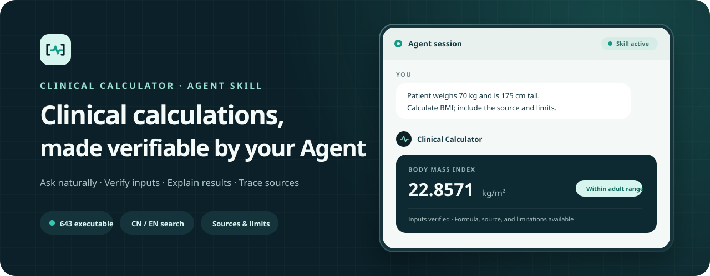
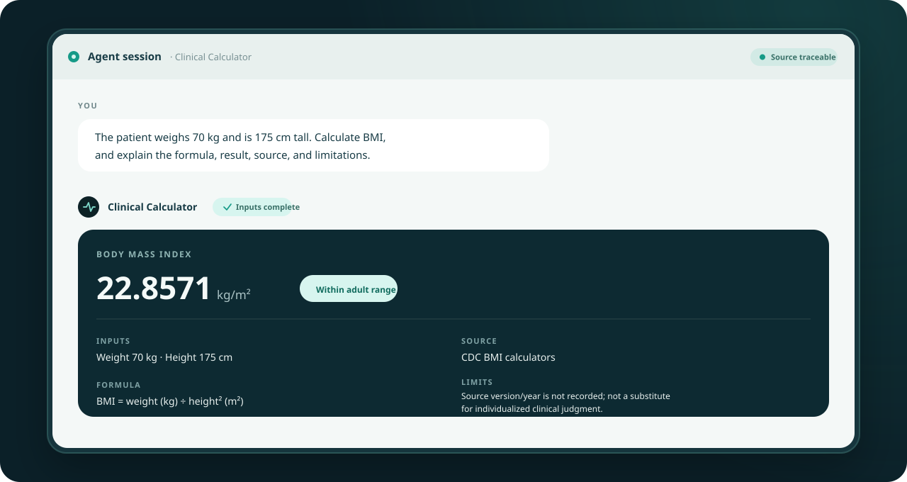
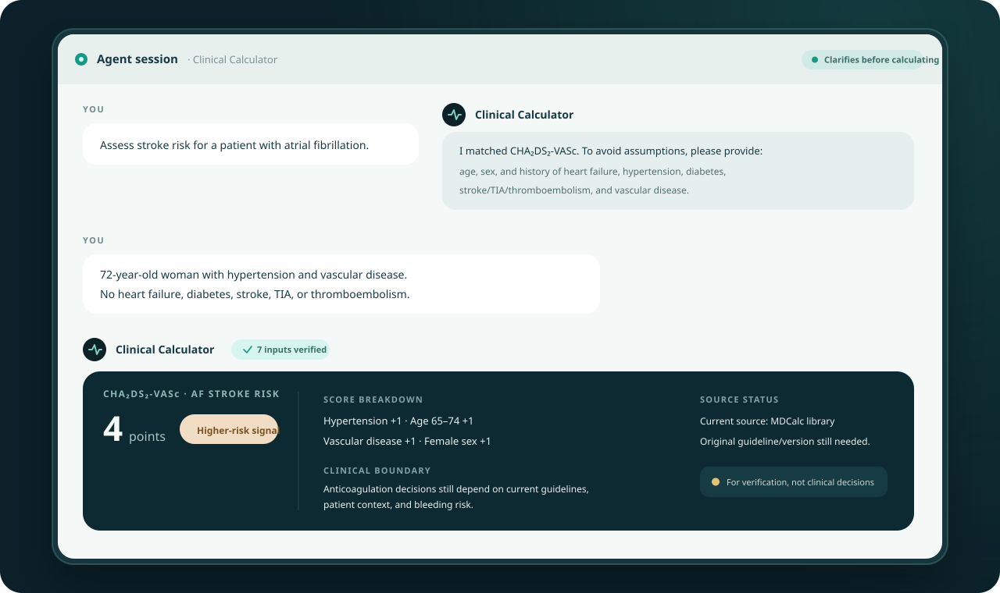
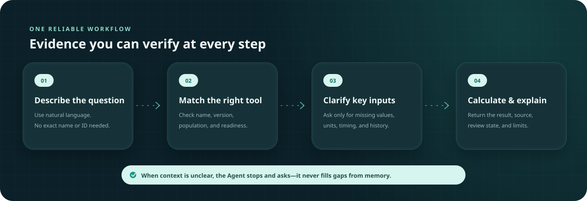

  <strong>English</strong> · <a href="./README.zh-CN.md">简体中文</a>

  

<h1 align="center">Clinical Calculator</h1>

  
  
  
  
  
  

  Give your Agent a clinical question or reliable source material. It can find, run, and explain calculators—or turn the material into a validated new calculator.

  <a href="#about-the-project">About</a> ·
  <a href="#use-it-through-an-agent">Get started</a> ·
  <a href="#real-world-usage">Examples</a> ·
  <a href="#how-the-agent-handles-a-calculation">Workflow</a> ·
  <a href="#safety-boundaries">Safety</a>

> [!IMPORTANT]
> This is a medical calculation capability library for AI Agents that support Agent Skills. It is not a standalone diagnostic product. Results are for decision support, education, and verification; they do not replace professional diagnosis, prescribing, or emergency care.

## About the project

Clinical Calculator turns calculation rules scattered across official resources, professional societies, original publications, clinical calculator platforms, and traceable research into a unified capability that an Agent can search, verify, and execute. It currently contains **643 locally executable entries**, covering **570 deduplicated calculator names**, **56 specialty categories**, and **555 distinct disease or clinical-scenario labels recorded in the inventory**. Together, the entries cite **220 traceable source links** across **125 source-site domains**; each retains its input requirements, implementation type, and the source currently recorded by the repository.

Users can also give the Agent guidelines, papers, formula specifications, tables, or other reliable source material. The Skill can extract explicit inputs, units, formulas, lookup tables, or decision trees from JSON, CSV, Markdown, PDF, DOCX, and written rules, then create and validate a draft before asking the user whether to install it as a new custom calculator.

Inclusion and local executability do not mean that a calculator's version, intended population, content rights, or clinical release status has received independent approval. The catalog is international rather than country-specific: its source material is predominantly recorded in English, but each calculator must still be checked against its original validation population, regional units, and current local guidance before use.

## Use it through an Agent

1. Add or open this repository in a tool that supports Agent Skills.
2. Describe the clinical question in natural language. Include any patient information you already have.
3. The Agent will select an appropriate calculator. If inputs, versions, or the target population are unclear, it will ask before calculating.

Try asking:

| What you want to do | Tell the Agent |
| --- | --- |
| Find the right tool | “Find a calculator for stroke risk in atrial fibrillation and tell me what information you need.” |
| Run a calculation | “The patient weighs 70 kg and is 175 cm tall. Calculate BMI and explain the formula, result, source, and limitations.” |
| Verify a score | “Work through CURB-65 item by item. Ask me about anything uncertain instead of assuming it.” |
| Add a new calculator | “I will provide a guideline or paper. Turn its explicit formula into a validated custom calculator, and show me the draft before installing it.” |

You do not need to know the exact calculator name or any technical details. Describe the problem; the Agent handles search, selection, and execution.

## Real-world usage

These scenarios use the repository’s current input contracts and actual calculation results. The interface is a generic Agent conversation rather than a specific client.

### Complete inputs: calculate and explain

  

### Missing inputs: ask first, then calculate

  

## How the Agent handles a calculation

  

The guiding principle is verify first, calculate second:

- The Agent will not silently choose between similarly named versions or populations.
- It asks when an input, unit, or time point is unclear instead of filling the gap itself.
- If a requested calculator is not included, it says so rather than reconstructing a formula from memory.
- Every result identifies the calculator, inputs, formula or rule, result, interpretation, source, and important limitations.

## What it can do

- Search Chinese and English clinical calculators, scores, staging systems, renal estimates, lab-derived indices, and unit conversions.
- Calculate from explicit inputs while preserving a reproducible calculation trail.
- Distinguish similar names, different versions, and adult versus pediatric populations.
- Flag incomplete inputs, unclear units, and values outside declared boundaries.
- Turn a supplied guideline, paper, table, or rules file into a custom formula, lookup table, or decision tree, validating it before installation and asking for your confirmation.

## Current coverage

The main inventory contains only entries with local calculation logic and explicit input contracts: **643 executable entries** covering **570 unique calculator names**. Of these, 593 calculate from original inputs and 50 are executable intermediate steps that require pre-scored components or upstream results.

The repository does not retain name-only entries, missing formulas, guideline-only knowledge, or restricted content that cannot be executed. Executable does not mean clinically approved for release.

## Supported calculators

[View the complete calculator catalog](./CALCULATORS_EN.md), grouped by specialty across all 643 executable entries. Each entry includes its English name, implementation type, and the source and link currently recorded by the repository.

## What a result includes

A complete response usually includes:

- Calculator and version
- Input values, units, and any necessary conversions
- Formula, scoring rule, or lookup basis
- Result, rounding, and applicable interpretation
- Source link and current review status
- Intended population, known limitations, and items requiring professional review

## Custom calculators

If an authoritative calculation rule is not included, give the Agent the JSON, CSV, Markdown, PDF, DOCX, guideline, paper, table, or written rule. It extracts only the inputs, units, boundaries, formula, tables, version, and known answers explicitly stated in that material. It does not fill in missing coefficients or thresholds from memory.

The workflow is: identify the explicit rules, create a custom-calculator draft, validate its structure and source-derived cases, and show the proposed inputs, rules, source, and tests to the user. Installation happens only after confirmation. Incomplete material remains a non-executable draft with the missing information clearly identified. Patient identifiers and case data are never stored in a calculator definition.

## Safety boundaries

- High-risk situations require the patient’s full clinical context, current guidance, and professional judgment.
- Drug-dose arithmetic must remain separate from prescribing decisions and be reviewed by a clinician or pharmacist.
- A runnable custom calculator has not necessarily received independent clinical review.
- The MIT license covers this repository’s own content; it does not grant redistribution rights for third-party questionnaires, proprietary tables, or staging content.
- If information is missing, ambiguous, or outside declared boundaries, the Agent should stop and explain rather than return a plausible-looking result.

## License

[MIT](./LICENSE) © Clinical Calculator contributors
