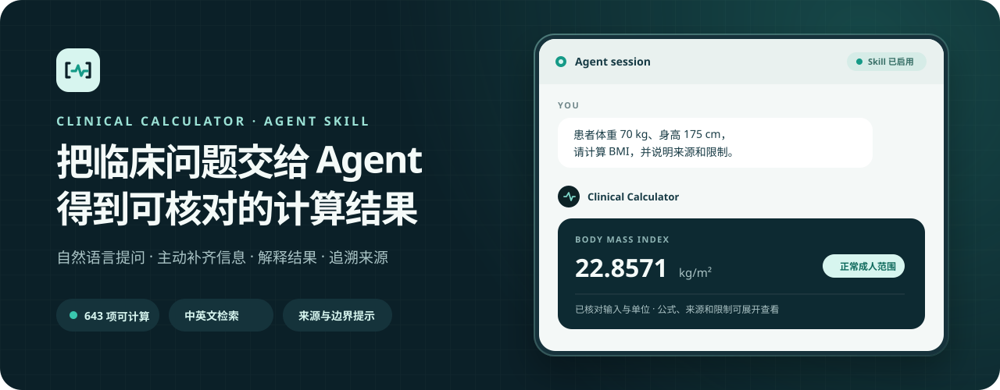
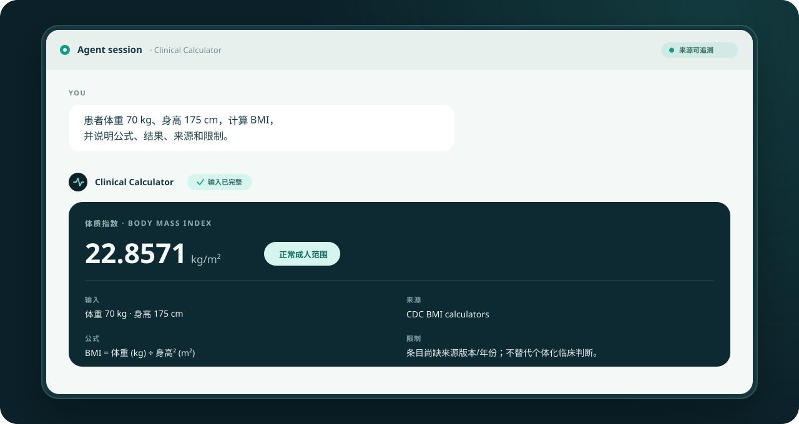
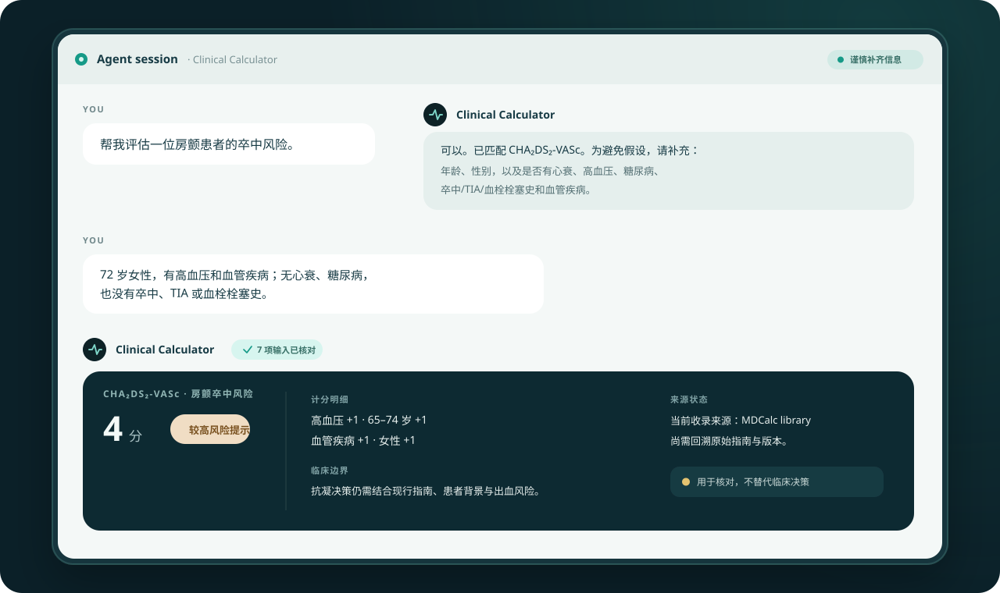
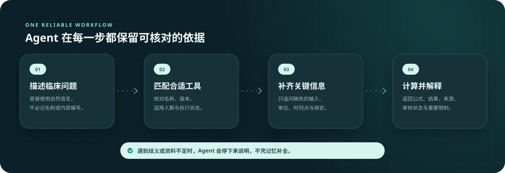

  

<h1 align="center">Clinical Calculator</h1>

  
  
  
  

  把临床问题直接告诉 Agent。它会查找合适的计算器、核对输入与单位、完成计算，并说明公式、来源与限制。

  <a href="#交给-agent-使用">开始使用</a> ·
  <a href="#实际使用">实际使用</a> ·
  <a href="#agent-如何完成一次计算">工作方式</a> ·
  <a href="#安全边界">安全边界</a>

> [!IMPORTANT]
> 这是一个供支持 Agent Skills 的 AI Agent 使用的医学计算能力库，不是独立诊疗产品。结果用于决策支持、教学与核对，不能替代专业诊断、处方或紧急处置。

## 交给 Agent 使用

1. 在支持 Agent Skills 的工具中添加或打开本仓库。
2. 用自然语言说明你要解决的临床问题；已有的患者信息可以一起提供。
3. Agent 会选择合适的计算器。遇到缺失信息、同名版本或适用人群不明确时，它会先向你确认，再给出结果。

你可以直接这样说：

| 你想做什么 | 告诉 Agent |
| --- | --- |
| 找到合适的工具 | “帮我找一下评估房颤卒中风险的计算器，并告诉我需要哪些信息。” |
| 完成一次计算 | “患者体重 70 kg、身高 175 cm，计算 BMI，并说明公式、结果、来源和限制。” |
| 核对评分过程 | “请逐项核对 CURB-65，不确定的项目先问我，不要自行假设。” |
| 收录自定义规则 | “我会提供一份权威来源文件，请把其中明确的公式整理成可验证的自定义计算器，安装前先让我确认。” |

不需要知道计算器的准确名称或任何技术细节。描述问题即可，搜索、选择和执行由 Agent 完成。

## 实际使用

下面两组场景使用了仓库当前的真实输入契约与计算结果。界面为通用 Agent 对话示意，不绑定某个特定客户端。

### 已提供完整信息：直接计算并解释

  

### 信息不完整：先追问，再计算

  

## Agent 如何完成一次计算

  

关键原则是“先核对，再计算”：

- 同名评分存在不同版本或适用人群时，Agent 不会静默代选。
- 输入、单位或时间点不明确时，Agent 会追问，不会自行补全。
- 请求的计算器未被收录时，Agent 会明确说明，不会凭记忆临时拼出公式。
- 返回结果时会同时给出计算器、输入、公式或规则、结果、解释、来源和重要限制。

## 能处理什么

- 搜索中英文临床计算器、评分、分期、肾功能估算、实验室衍生指标与单位换算。
- 根据明确输入完成计算，并保留可复核的计算过程。
- 区分相似名称、不同版本、成人与儿童等适用范围。
- 对输入不完整、单位不明确或超出边界的情况给出明确提示。
- 从你提供的可靠资料中整理自定义公式、查表或决策树；验证通过并经你确认后再安装。

## 当前覆盖

主目录只收录具备本地计算逻辑和明确输入契约的内容：共 **643** 个可执行条目，覆盖 **570** 个唯一中文名称。其中 593 个可以从原始输入完成计算，50 个用于需要预评分组件或上游结果的中间计算。

仓库不保留只有名称、缺少公式、属于指南知识或受授权限制的不可执行条目。可执行仍不等同于已经获得临床发布批准。

## 结果里会说明什么

一次完整回答通常包括：

- 使用的计算器与版本
- 输入值、单位和必要的换算
- 公式、计分规则或查表依据
- 结果、取整方式与适用的解释
- 来源链接及当前审核状态
- 适用人群、已知限制与需要专业复核的事项

## 自定义计算器

如果权威资料中的公式尚未收录，可以把资料文件或书面规则交给 Agent。Agent 只提取资料中明确写出的输入、单位、边界、公式、表格、版本和已知答案；不会凭记忆补齐缺失的系数或阈值。

自定义内容会先作为草稿接受结构与已知案例验证。Agent 会向你展示拟收录的规则和测试，只有在你确认后才会安装为可使用的计算器。

## 安全边界

- 高风险场景必须结合患者状态、完整指南和专业人员判断。
- 药物剂量计算与具体处方决策必须分开，并由临床医生或药师复核。
- 自定义计算器即使能够运行，也不代表已经通过独立临床审核。
- MIT 许可只覆盖仓库自身内容，不自动授予第三方问卷、专有表格或分期内容的再分发权。
- 若输入不足、存在歧义或超出声明边界，Agent 应停止计算并明确说明，而不是生成看似可信的结果。

## 了解更多

- [查看 Skill 工作流与安全约束](./SKILL.md)
- [了解来源与收录方法](./clinical_calculator_source_methodology.md)
- [参与维护与贡献](./CONTRIBUTING.md)

## License

[MIT](./LICENSE) © Clinical Calculator contributors
